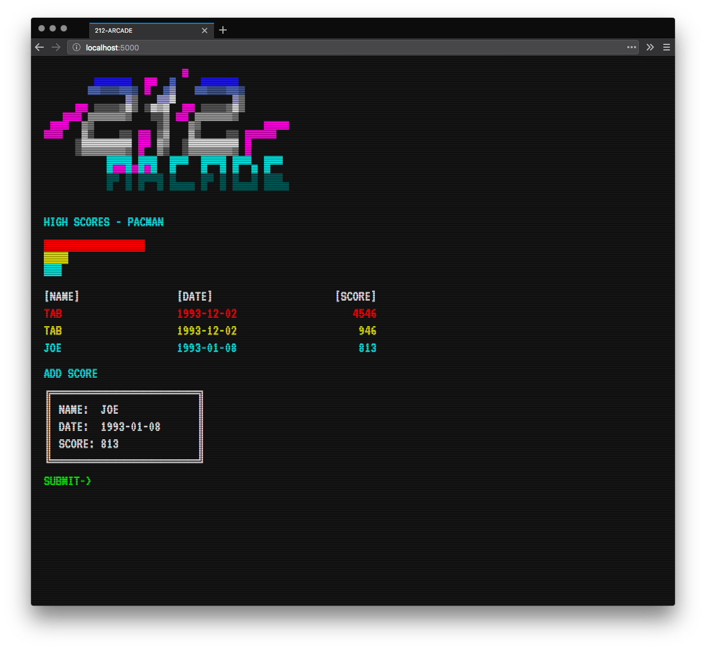
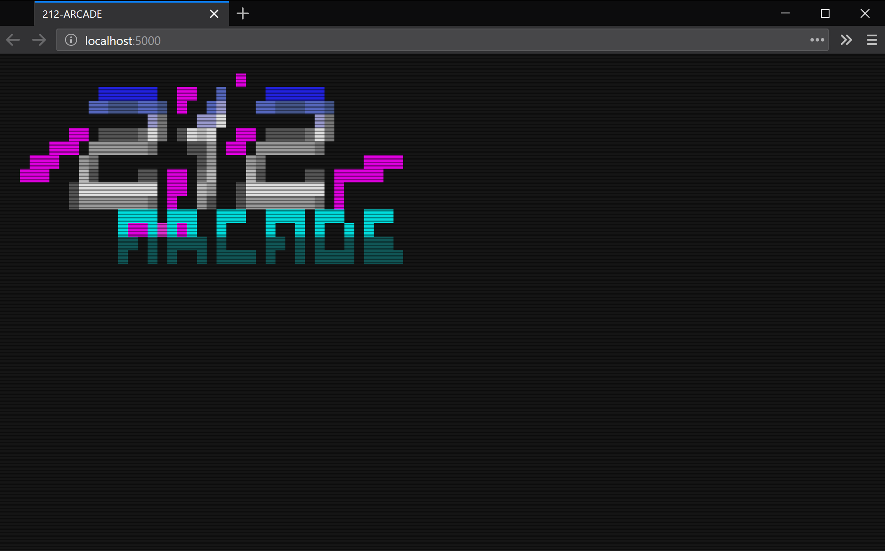
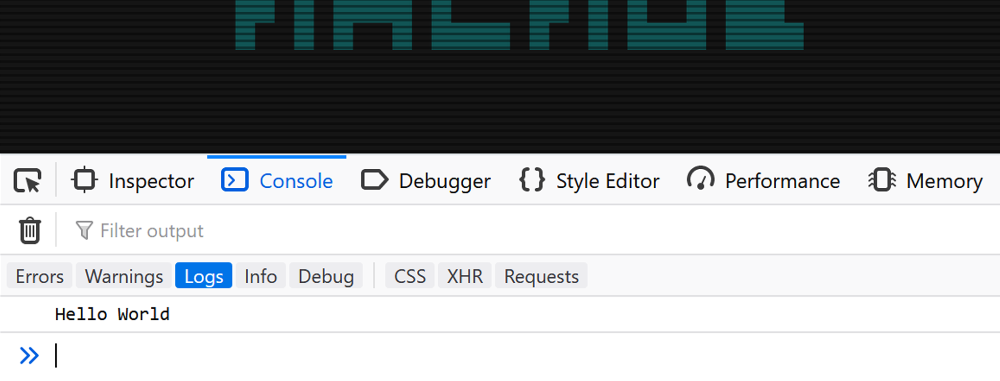
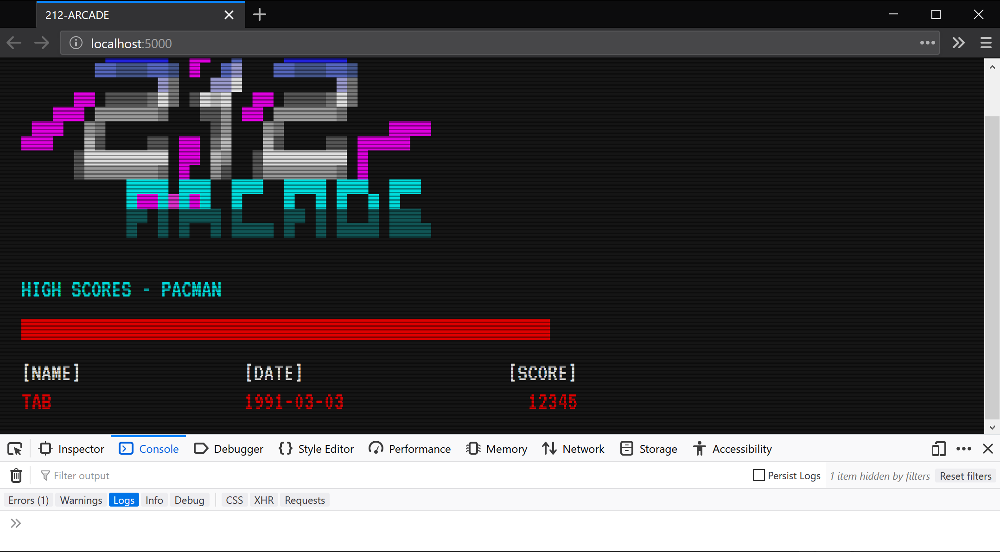
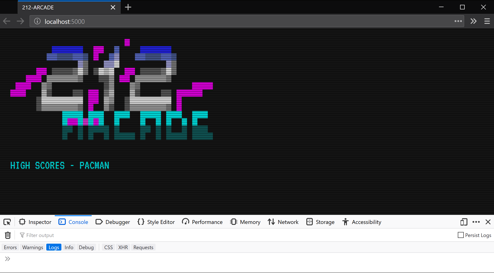
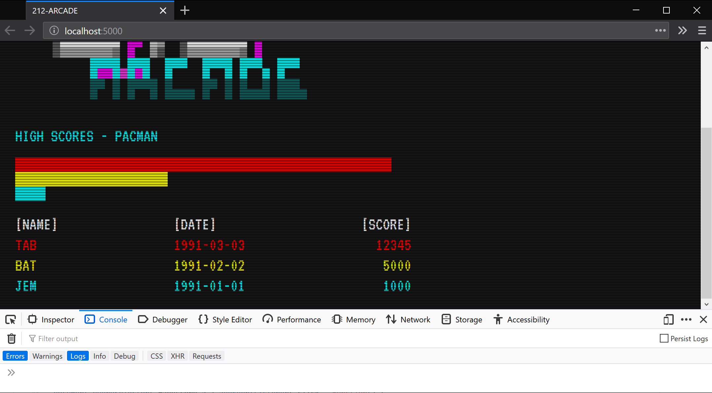
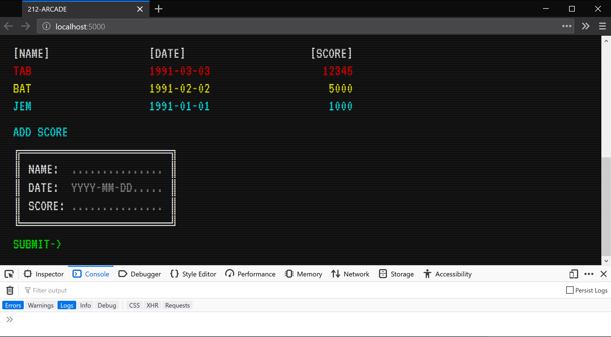
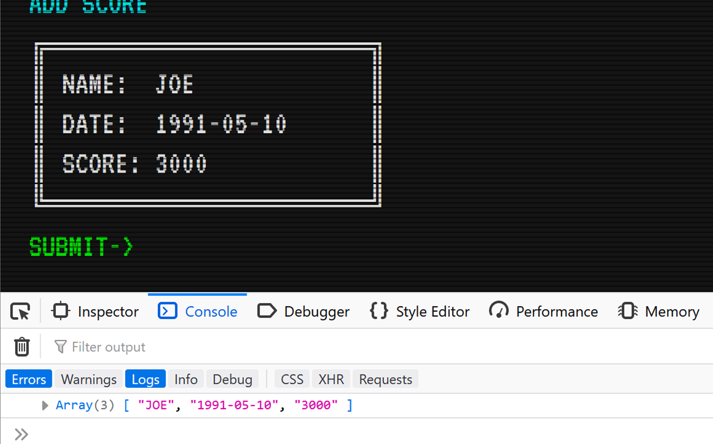
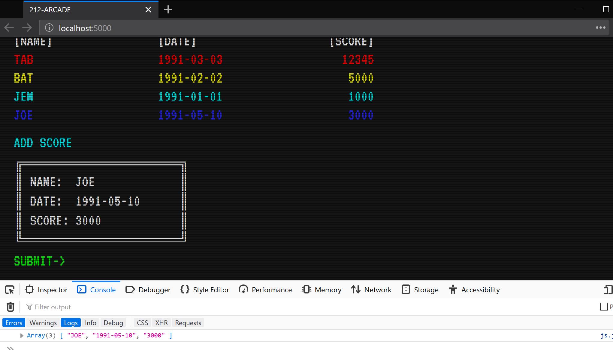

JavaScript
==========

"JavaScript is incredibly versatile. You can start small, with carousels, image galleries, fluctuating layouts, and button click responses. With more experience, you'll be able to create games, animated 2D and 3D graphics, comprehensive database-driven apps, and much more!"  
*-- https://developer.mozilla.org/docs/Learn/Getting_started_with_the_web/JavaScript_basics*

In this lesson, we'll create a new Flask app, then add some JavaScript code to it. We'll be building a RESTful application (more on this later), which means our Flask structure will be a little different from the first project.

More specifically, we'll be creating a web-app for logging high scores, with a BSS-inspired theme:



Setting Up the Flask App
------------------------

Create a new directory (and repo?) named "212-arcade". Setup a new Python virtual environment and install the Flask packages (using `pip`).

We'll begin with a simple *run.py* file with the following code:

```py
from flask import Flask, render_template

app = Flask(__name__)

@app.route('/')
def index():
    return render_template('index.html')
```

From this code, you can tell that you require a template file named *index.html*. Create your template directory, and within it, the index file:

```
212-arcade
│  run.py
│
└──templates
   │  index.html

```

Add the following code:

*index.html*
```html
<!DOCTYPE html>

<html>

  <head>
    <meta charset="utf-8">
    <title>212-ARCADE</title>
    <meta name="description" content="High scores for arcade games." />
    <meta name="viewport" content="width=device-width, initial-scale=1, shrink-to-fit=no">
    <link rel="stylesheet" href="{{ url_for('static', filename='screen.css') }}" />
  </head>

  <body>
    <div id="scanlines"></div>

    <div id="container">

    </div>
  </body>

</html>
```

Download the [assets](../../assets). Move those files into your working project directory:

```
212-arcade
│  run.py
│
└──templates
   │  index.html
└──static
   │  logo.gif
   |  scanline.svg
   |  screen.css

```

Run your Flask app. Check the results in your browser, which should look like this:



Next up: adding some JavaScript.

Browser Console
---------------

Before writing any JavaScript, open your browser's developer console:

* Instructions for Firefox:  
https://developer.mozilla.org/en-US/docs/Tools/Web_Console
* Instructions for Chrome:  
https://developers.google.com/web/tools/chrome-devtools

We'll be using the console to assist us with JavaScript development. I recommend keeping this open whenever you're writing JavaScript code.

`console.log()`
---------------

The `console.log()` is useful for debugging. It displays output to the developer console only.

Add a new pair of script tags, just before your closing `</body>` tag. Within these, add a `console.log()`:

```html
    ...
    <script>
      console.log('Hello World');
    </script>

  </body>

</html>
```

Save and reload your browser:



**Note:** the console may display an error about a missing favicon file. A *favicon* (favourite icon) is that shortcut/tab/bookmark icon associated with your website. You can spot one in the browser tab for just about any website you're viewing. Your web browser tries to load a favicon from a default location on your website. To add a favicon, and suppress this error, you can follow this simple guide: https://www.digitalocean.com/community/tutorials/how-to-add-a-favicon-to-your-website-with-html

The browser console is also interactive, meaning that you can type in JavaScript commands and have them execute on entry.

JavaScript Fundamentals
-----------------------

JavaScript has many of the standard features you'd expect to find in a scripting/programming language. While these features may be similar to Python, the syntax does vary.

Here's an example of an `if` statement and a `for` loop. There's no need to add them to your working project, although you can experiment if you like.

### If/Else-If/Else Statements

```js
    ...
    <script>
      let mark = 65;

      if (mark > 80) {
        document.write('A');
      }
      else if (mark > 70) {
        document.write('B');
      }
      else if (mark > 60) {
        document.write('C');
      }
      else if (mark > 50) {
        document.write('D');
      }
      else if (mark < 50) {
        document.write('fail');
      }
    </script>

  </body>

</html>
```

### For Loops

```js
    ...
    <script>
    for (let i=1; i<=21; i++) {
      console.log(i);
    }
    </script>

  </body>

</html>
```

External JavaScript
-------------------

Just like CSS, JavaScript can be placed in an external file. Because we're running a Flask website, we'll link this like any other static resource:

```html
    ...
    <script src="{{ url_for('static', filename='js.js') }}"></script>
  </body>

</html>
```

Note that the JavaScript -- or link to it -- is placed just before the closing `body` tag. JavaScript cannot address anything that has not been loaded yet (in the HTML above it).

Create a new JavaScript file named "js.js" and save it in your static directory:

```
212-arcade
│  run.py
│
└──templates
   │  index.html
└──static
   │  logo.gif
   |  scanline.svg
   |  screen.css
   |  js.js

```

For now, leave the JavaScript file empty. We'll add some more HTML, then some JavaScript to control it.

Adding a Score Using JavaScript
-------------------------------

Once you can address elements with JavaScript, you can manipulate them as you please. There are many ways to select elements using JavaScript. Using `document.getElementById()`, you can address any element by its `id` attribute.

To begin add some more HTML:

*index.html*
```html
  ...

  <div id="container">

    <h1>HIGH SCORES - PACMAN</h1>

    <div id="chart">
      <div class="bar" style="background-color:#D00; width:95%"></div>
    </div>

    <table id="highscores">
      <tr>
        <th>[NAME]</th>
        <th>[DATE]</th>
        <th>[SCORE]</th>
      </tr>
      <tr style="color:#D00">
        <td>TAB</td>
        <td>1991-03-03</td>
        <td>12345</td>
      </tr>
    </table>

    ...
```

You've added a single high score entry in HTML:



Let's remove this using JavaScript. Use the `document.getElementById()` to select the elements you want, and the `innerHTML` attribute to set the HTML within those to nothing:

*js.js*
```js
document.getElementById('highscores').innerHTML = '';
document.getElementById('chart').innerHTML = '';
```

The result is an empty high scores table:



Now, we'll add bars and scores using JavaScript:

*js.js*
```js
document.getElementById('highscores').innerHTML = '<tr><th>[NAME]</th><th>[DATE]</th><th>[SCORE]</th></tr>';
document.getElementById('chart').innerHTML = '';

// insert entry

let bar = document.createElement('div');
bar.className = 'bar';
bar.style.width = '95%';
bar.style.backgroundColor = '#D00';
document.getElementById('chart').appendChild(bar);

let row = document.createElement('tr');
row.style.color = '#D00';
row.innerHTML += '<td>TAB</td>';
row.innerHTML += '<td>1991-03-03</td>';
row.innerHTML += '<td>12345</td>';
document.getElementById('highscores').appendChild(row);
```

So, we're back to what we had before, but this is all JavaScript-controlled now:

.png)

You can comment out your chart and table code to confirm this:

*index.html*
```html
    ...

    <div id="chart">
      <!--
      <div class="bar" style="background-color:#D00; width:95%"></div>
      -->
    </div>

    <table id="highscores">
      <tr>
        <th>[NAME]</th>
        <th>[DATE]</th>
        <th>[SCORE]</th>
      </tr>
      <!--
      <tr style="color:#D00">
        <td>TAB</td>
        <td>1991-03-03</td>
        <td>12345</td>
      </tr>
      -->
    </table>

    ...
```

Storing the Scores in an Array
------------------------------

JavaScript arrays, like Python lists, use square bracket notation. We'll use a 2-dimensional list to store the scores.

Add these variables to the top of your JavaScript file:

*js.js*
```js
// variables

let colors = [
  '#D00',
  '#DD0',
  '#0DD',
  '#22D',
  '#D0D'
];

let scores = [
  ['TAB','1991-03-03','12345'],
  ['BAT','1991-02-02','5000'],
  ['JEM','1991-01-01','1000']
];

let topscore = 13000;
```

Use a `for` loop to display all of the `scores`:

*js.js*
```js
...
for (let i=0; i < scores.length; i++) {
  let bar = document.createElement('div');
  bar.className = 'bar';
  bar.style.width = scores[i][2] / topscore * 100 + '%';
  bar.style.backgroundColor = '#D00';
  document.getElementById('chart').appendChild(bar);

  let row = document.createElement('tr');
  row.style.color = '#D00';
  row.innerHTML += '<td>' + scores[i][0] + '</td>';
  row.innerHTML += '<td>' + scores[i][1] + '</td>';
  row.innerHTML += '<td>' + scores[i][2] + '</td>';
  document.getElementById('highscores').appendChild(row);
}
```

The result is three scores, with red bars:


However, we'd like alternating colours (not all red). Add a new `color` variable that uses a modulo operator, and change two other lines in the `for` loop to use this value:

*js.js*
```js
...
for (let i=0; i < scores.length; i++) {
  let color = colors[i%colors.length];

  ...
  bar.style.backgroundColor = color;
  ...
  row.style.color = color;
  ...
```

Save, and refresh your browser. You should see multi-coloured bands and scores.



Next, we'll add a form so that the user can enter new scores.

Adding a Form
-------------

Rather than send our form input to a backend, we'll have JavaScript handle it.

Add a form to your HTML:

*index.html*
```html
      ...
    </table>

    <h1>ADD SCORE</h1>

    <form id="addscore">
      ╔════════════════╗<br />
      ║ NAME:&nbsp; <input id="name"  type="text" placeholder="..............." /> ║<br />
      ║ DATE:&nbsp; <input id="date"  type="text" placeholder="YYYY-MM-DD....." /> ║<br />
      ║ SCORE:      <input id="score" type="text" placeholder="..............." /> ║<br />
      ╚════════════════╝<br />
      <a>SUBMIT-&gt;</a>
      <span class="alert"></span>
    </form>

    ...
```



Now add some JavaScript that listens for when the user clicks the submit button:

*js.js*
```js
...

// submit button

document.querySelector('#addscore a').addEventListener('click', () => {
  let entry = [
    document.getElementById('name').value,
    document.getElementById('date').value,
    document.getElementById('score').value
  ];

  console.log(entry);
});
```



Great! We've got access to user values in JavaScript. Empty your `scores` array:

```js
let scores = [
  /*
  ['TAB','1991-03-03','12345'],
  ['BAT','1991-02-02','5000'],
  ['JEM','1991-01-01','1000']
  */
];
```

Call an `insertEntry()` function:

```js
  ...

  console.log(entry);
  insertEntry(entry);
});
```

And, turn your existing entry code into a corresponding function:

*js.js*
```js
// insert entry

function insertEntry(entry) {
  scores.push(entry);

  document.getElementById('highscores')...
    ...
    document.getElementById('highscores').appendChild(row);
  }
}
```

You can now add entries using the form:



Finally, add some validation logic. The complete submit button code looks like this:

```js
// submit button

document.querySelector('#addscore a').addEventListener('click', () => {
  let entry = [
    document.getElementById('name').value,
    document.getElementById('date').value,
    document.getElementById('score').value
  ];

  document.querySelector('#addscore .alert').innerHTML = '';

  if (entry[0] == '') {
    document.querySelector('#addscore .alert').innerHTML = 'RE-ENTER NAME!';
  }
  else if (entry[1].search(/[0-9]{4}-[0-9]{2}-[0-9]{2}/) == -1) {
    document.querySelector('#addscore .alert').innerHTML = 'RE-ENTER DATE!';
  }
  else if (entry[2].search(/^[0-9]*$/) < 0 || entry[2] == '') {
    document.querySelector('#addscore .alert').innerHTML = 'RE-ENTER SCORE!';
  }
  else {
    insertEntry(entry);
  }
});
```

Each time you refresh the web page, you lose the scores you've accumulated. In the next lesson we'll look at storing these in an SQLite database.

*end*
