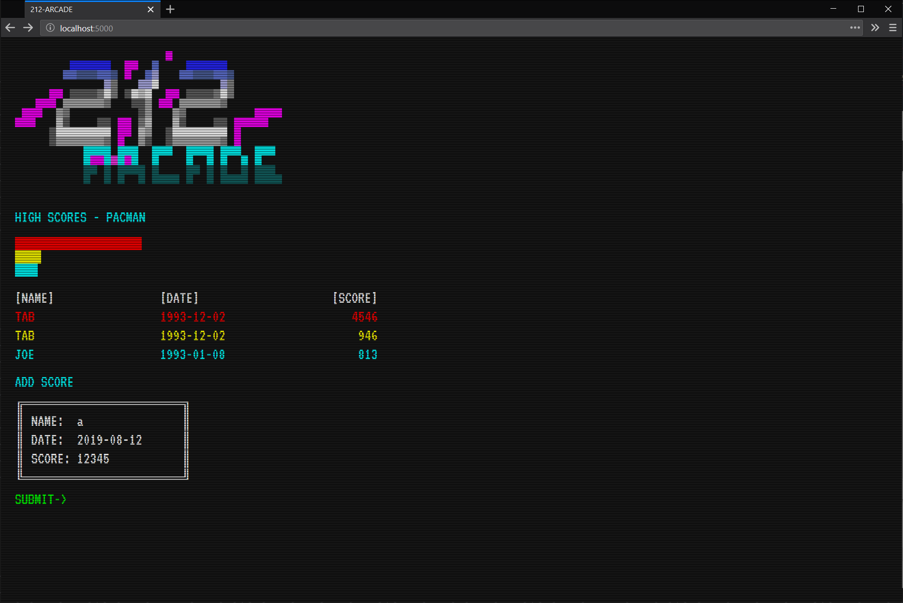

*289.212.08.workshop*

<!-- markdown-pdf -s md.css -h md.js notes.md -m '{"html":true}' -->

Building a RESTful API
======================

In this lesson, you'll build a RESTful API for your 212-Arcade web-app. The app will continue to look and behave in the same way it does currently, but store and retrieve the high score entries from a database. In this way, you won't lose your records every time you refresh your browser.

Your lecture covered CRUD, but for your reference, here's a table of the operations you'll need for an API:

Operation            | SQL    | RESTful WS
---------------------|--------|-----------
**C**reate           | INSERT | POST      
**R**ead (Retrieve)  | SELECT | GET       
**U**pdate (Modify)  | UPDATE | PUT       
**D**elete (Destroy) | DELETE | DELETE    

The GET Method
--------------

You'll need *Postman* for this section, which you can download for free at:  
https://www.getpostman.com/

Let's begin by creating a new Flask route that caters for a GET request:

```py
@app.route('/scores', methods=['GET'])
def scores_list():
    return 'score'
```

Run your Flask server. Then open Postman and:

1. set the request to GET;
2. the URL is http://localhost:5000/scores (your new route);
3. click *Send*;
4. confirm that the response reads `score`.


Yay! You've got your API responding!

However, we'd like to work with JSON (as opposed to plain-text), so add `jsonify` to your import line, and wrap your data (just `score` for now) with a `jsonify()` function:

```py
from flask import Flask, render_template, jsonify
...

@app.route('/scores', methods=['GET'])
def scores_list():
    return jsonify('score')
```

Save. Click *Send* again in Postman. Now your response is wrapped in quotes.


This may seem like a rather useless function, but `jsonify()` does much more than just wrap text in quotes. As you'll see shortly, `jsonify()` can convert complex, nested Python lists to JSON-formatted responses.

Setting Up a Database
---------------------

Before you begin adding API features to store data, you require a database to store information.

Begin by importing `sqlite3` and defining a file name for your database:

```py
from flask import Flask, render_template, jsonify

import sqlite3
SCORESDB = 'scores.db'
...
```

Now set up a new SQLite database -- using the terminal command `sqlite3 scores.db` -- and define a table for your high scores:

```
CREATE TABLE scores(
  id INTEGER PRIMARY KEY,
  name TEXT NOT NULL,
  date TEXT NOT NULL,
  score INTEGER NOT NULL
);
```

Add some entries:

```
INSERT INTO scores(name,date,score) VALUES('TAB','1993-12-02',4546);
INSERT INTO scores(name,date,score) VALUES('TAB','1993-12-02',946);
INSERT INTO scores(name,date,score) VALUES('JOE','1993-01-08',813);
```

Next, you need Flask to retrieve those scores when the API receives a request for them.

Retrieving Values from the Database
-----------------------------------

Update your `scores_list()` function to connect to- and query the database:

```py
@app.route('/scores', methods=['GET'])
def scores_list():
    #return jsonify('score')
    con = sqlite3.connect(SCORESDB)
    scores = []
    cur = con.execute('SELECT * FROM scores ORDER BY score DESC')

    for row in cur:
        scores.append(list(row))
    con.close()
    return jsonify(scores)
```

Now check the Postman output (click *Send* again). With richer data, the response looks a lot more like a typical JSON file:


You can retrieve data from the database using Postman. Let's do this using JavaScript.

Open your *js.js* file and add the following code:

```js
// load scores

fetch('/scores', { method: 'GET' })
  .then(response => console.log(response))
```

This code creates a new request to `fetch` some data from `/scores` using a `GET` method. When it receives a response, it executes the `.then` code; this will display the response in the developer console. All HTTP requests provide response codes indicating the *status* of a request:

Code         | State
-------------|------------------------
**100--199** | informational responses
**200--299** | successful responses
**300--399** | redirects
**400--499** | client errors
**500--599** | server errors

Now you know where `404` (not found) errors come from!

If you check the browser console, the response `status` should be `200`:

~~~
Response { type: "basic", url: "http://localhost:5000/scores", redirected: false, status: 200, ok: true, statusText: "OK", headers: Headers, body: ReadableStream, bodyUsed: false }
~~~

Amend the `fetch` code. It must use the JSON data to populate your high scores:

```js
...

fetch('/scores', { method: 'GET' })
  .then(response => response.json())
  .then(data => {
    for (let i=0; i<data.length; i++) {
      insertEntry([
        data[i][1],
        data[i][2],
        data[i][3]
      ]);
    }
  });
```

Save and reload your browser. The page now displays the entries from your database:



Next, let's modify the web-app to capture entries and enter them into the database.

Entering Values into the Database
---------------------------------

In this case, we use a `POST` as opposed to `GET` method. Again, we'll be using the endpoint `/scores`. You don't have to use this; you could have a different endpoint -- say, `enter_scores/` -- as long as there's no matching method-path route in use already.

For ideas on API design, perhaps have a play with this placeholder demo (using Postman?):  
https://jsonplaceholder.typicode.com/

Import the Flask `request` module, and add a new route to your *run.py*:

```py
from flask import Flask, render_template, jsonify, request

...

@app.route('/scores', methods=['POST'])
def scores_add():
    entry = request.json
    con = sqlite3.connect(SCORESDB)
    cur = con.execute('INSERT INTO scores(name,date,score) VALUES(?,?,?)', entry)
    con.commit()
    con.close()
    return jsonify('success')
```

The `request.json` will parse the JSON data Flask has received, converting it to a Python list/dictionary data structure.

In your *js.js* file, modify your submit button code:

```js
...

document.querySelector('#addscore a').addEventListener('click', () => {
  ...
  else {
    fetch('/scores', {
      method: 'POST',
      headers: { 'Content-type': 'application/json' },
      body: JSON.stringify(entry)
    })
    .then(response => response.json())
    .then(data => {
      insertEntry(entry)
    });
  }
});

...
```

This code is similar enough to your GET request. However, method argument is set to `POST`, and there are `headers` and `body` arguments to specify the content type and data, respectively. The `JSON.stringify()` method converts a JavaScript object or value to a JSON-formatted string.


Try to add a new score using the form. It's added to the bottom of the list without the page having to refresh; at the same time, Flask enters this new entry into the database. However, refreshing the page arranges the scores from highest to lowest.

*end*
