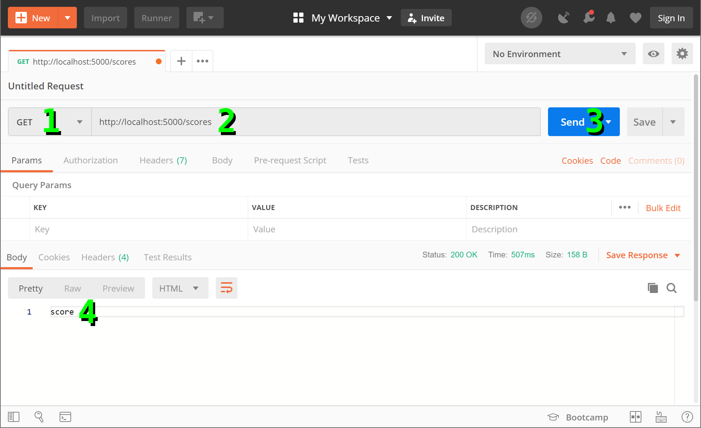
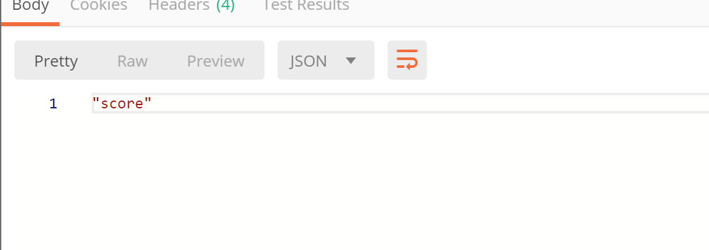
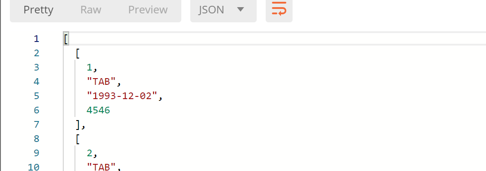
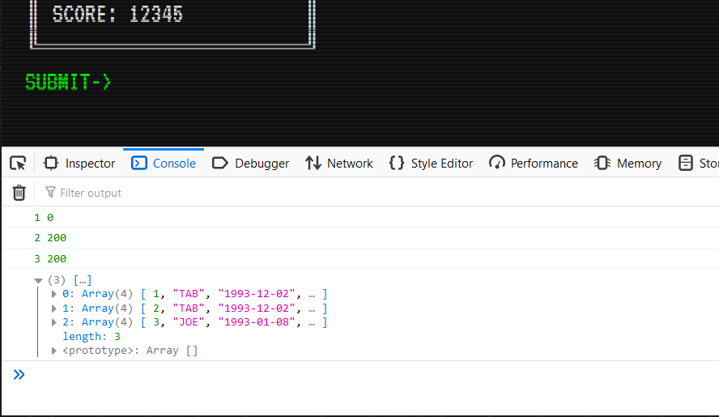

*289.212.08.workshop*

<!-- markdown-pdf -s md.css -h md.js notes.md -m '{"html":true}' -->

Building a RESTful API
======================

In this lesson, you'll build a RESTful API for your 212-Arcade web-app. The app will continue to look and behave in the same way it does currently, but store and retrieve the high score entries from a database. In this way, you won't lose your records every time you refresh your browser.

Your lecture covered CRUD, but for your reference, here's a table of the operations you'll need for an API:

Operation            | SQL    | RESTful WS
---------------------|--------|-----------
**C**reate           | INSERT | POST      
**R**ead (Retrieve)  | SELECT | GET       
**U**pdate (Modify)  | UPDATE | PUT       
**D**elete (Destroy) | DELETE | DELETE    

The GET Method
--------------

You'll need *Postman* for this section, which you can download for free at:  
https://www.getpostman.com/

Let's begin by creating a new Flask route that caters for a GET request:

~~~
@app.route('/scores', methods=['GET'])
def scores_list():
    return 'score'
~~~

Run your Flask server. Then open Postman and:

1. set the request to GET;
2. the URL is http://localhost:5000/scores (your new route);
3. click *send*;
4. confirm that the response reads "score".

Yay! You've got your API responding!

However, we'd like to work with JSON (as opposed to plain-text), so add `jsonify` to your import line, and wrap your data (just 'score' for now) with a `jsonify()` function:

~~~
from flask import Flask, render_template, jsonify
...

@app.route('/scores', methods=['GET'])
def scores_list():
    return jsonify('score')
~~~

Save. Click *send* again in Postman. Now your response is wrapped in quotes.

This may seem like a rather useless function, but `jsonify()` does much more than just wrap text in quotes. As you'll see shortly, it's able to convert complex, nested Python lists to JSON-formatted responses.

Setting Up a Database
---------------------

Before we begin adding API features to store data, we require a database to store information.

Begin by importing `sqlite3` and defining a file name for your database:

~~~
from flask import Flask, render_template, jsonify

import sqlite3
SCORESDB = 'scores.db'
...
~~~

Now set up a new SQLite database -- using the terminal command `sqlite3 scores.db` -- and define a table for your high scores:

~~~
CREATE TABLE scores(
  id INTEGER PRIMARY KEY,
  name TEXT NOT NULL,
  date TEXT NOT NULL,
  score INTEGER NOT NULL
);
~~~

Add some entries:

~~~
INSERT INTO scores(name,date,score) VALUES('TAB','1993-12-02',4546);
INSERT INTO scores(name,date,score) VALUES('TAB','1993-12-02',946);
INSERT INTO scores(name,date,score) VALUES('JOE','1993-01-08',813);
~~~

We now need Flask to retrieve the scores when the API receives a request for them.

Retrieving Values from the Database
-----------------------------------

Update your `scores_list()` function to connect to- and query the database:

~~~
@app.route('/scores', methods=['GET'])
def scores_list():
    #return jsonify('score')
    con = sqlite3.connect(SCORESDB)
    scores = []
    cur = con.execute('SELECT * FROM scores ORDER BY score DESC')

    for row in cur:
        scores.append(list(row))
    con.close()
    return jsonify(scores)
~~~

Now check your Postman output. With richer data, the response looks a lot more like a typical JSON file:

We are now able to retrieve data from our database using Postman. Let's do this using JavaScript.

Open your *js.js* file and add the following code:

~~~
// load scores

let req = new XMLHttpRequest();
req.onreadystatechange = () => {
  if (this.readyState == 4 && this.status == 200) {
    let json = JSON.parse(req.responseText)
    console.log(json)
  }
  else {
    // log failure
    console.log(this.readyState, this.status);
  }
};
req.open('GET', '/scores', true);
req.send();
~~~

This code creates a new XMLHttpRequest, assigned to variable `req`. The `req.onreadystatechange` does not run immediately -- only when one calls the `req.open()` or `req.send()`. These two functions return the following `readyState` codes:

Value  | State            | Description
-------|------------------|------------
0      | UNSENT           | client has been created; open() not called yet
1      | OPENED           | `open()` has been called.
2      | HEADERS_RECEIVED | `send()` has been called; headers and status are available
3      | LOADING          | downloading; `responseText` holds partial data
4      | DONE             | operation is complete

All HTTP requests (XMLHttpRequest included) provide response codes indicating the `status` of a request:

Code         | State
-------------|------------------------
**100--199** | informational responses
**200--299** | successful responses
**300--399** | redirects
**400--499** | client errors
**500--599** | server errors

Now you know where `404` (not found) errors come from!

So, `if (this.readyState == 4 && this.status == 200)` indicates that the `readyState` is done, and the request successful.

The `let json = JSON.parse(req.responseText)` converts the JSON data to a JavaScript object. You can explore this in your browser console:

Now, use this data to populate your high scores:

~~~
    ...
    console.log(json)

    for (let i=0; i<json.length; i++) {
      insertEntry([
        json[i][1],
        json[i][2],
        json[i][3]
      ]);
    ...
}
~~~

Save and reload your browser. The page now displays the entries from your database:

Next, let's modify the web-app to capture entries and enter them into the database.

Entering Values into the Database
---------------------------------

In this case, we use a `POST` as opposed to `GET` method. Again, we will be using the endpoint `/scores`. You don't have to use this; you could have a different endpoint -- say, `enter_scores/` -- as long as there is no matching method-path combo in use already.

For ideas on API design, perhaps have a play with this placeholder demo (using Postman?):  
https://jsonplaceholder.typicode.com/

Import the Flask `request` module, and add a new route to your *run.py*:

~~~
from flask import Flask, render_template, jsonify, request

...

@app.route('/scores', methods=['POST'])
def scores_add():
    entry = request.json
    con = sqlite3.connect(SCORESDB)
    cur = con.execute('INSERT INTO scores(name,date,score) VALUES(?,?,?)', entry)
    con.commit()
    con.close()
    return 'success'
~~~

The `request.json` will parse the JSON data Flask has received.

In your *js.js* file, modify your submit button code:

~~~
...

document.querySelector('#addscore a').addEventListener('click', () => {
  ...
  else {
    let req = new XMLHttpRequest();
    req.onreadystatechange = () => {
      if (this.readyState == 4 && this.status == 200) {
        insertEntry(entry);
      }
      else {
        console.log(this.readyState, this.status);
      }
    };
    req.open('POST', '/scores', true);
    req.setRequestHeader('Content-type', 'application/json');
    let body = JSON.stringify(entry)
    req.send(body);
  }
});

...
~~~

This code is similar enough to your GET request. However, the `req.open()` method argument is set to `POST`. The `JSON.stringify()` method converts a JavaScript object or value to a JSON-formatted string.

Try to add a new score using the form. It is added to the bottom of the list without the page having to refresh. At the same time, Flask enters this new entry into the database. However, refreshing the page arranges the scores from highest to lowest.

*end*
